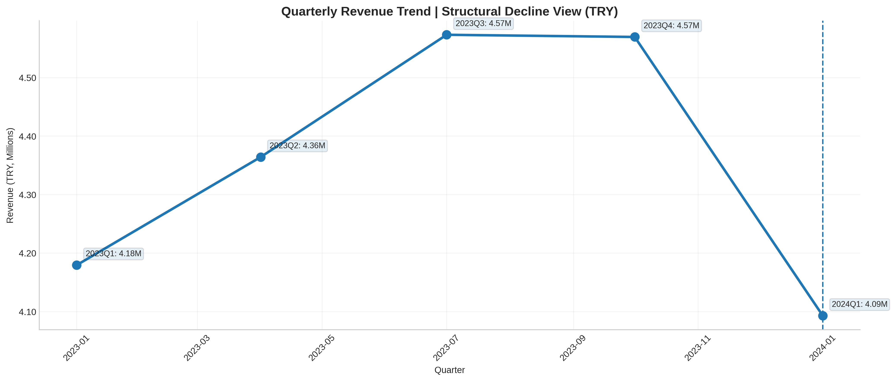
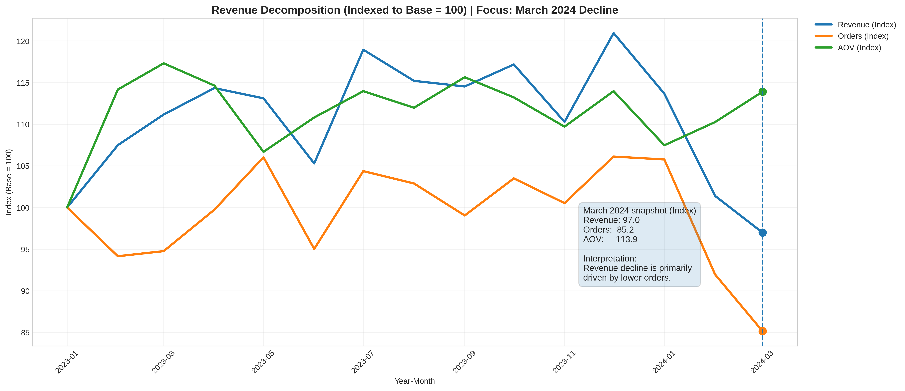
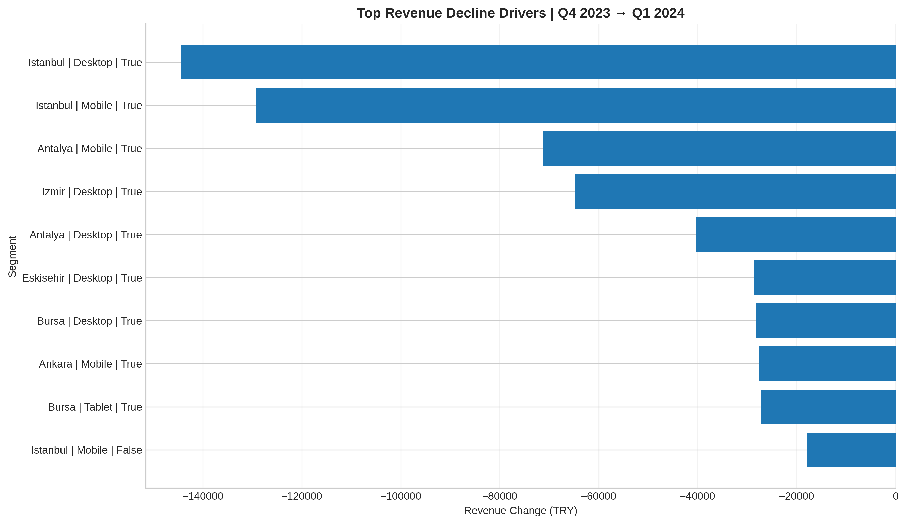

# 📉 Ecommerce Revenue Contraction Diagnostic (Q1 2024)

---

## 1️⃣ Problem Statement

Revenue declined in **Q1 2024 relative to Q4 2023**, raising concerns about potential structural performance deterioration.

The objective of this analysis is to diagnose the primary drivers of the contraction through structured revenue decomposition, segment-level attribution, and behavioral validation.

### Quarterly Revenue Trend (Structural View)

The quarterly view confirms that Q1 2024 represents a structural decline relative to the prior growth trajectory.

---

## 2️⃣ Trend Analysis & Revenue Decomposition

Revenue was decomposed using:

> **Revenue = Orders × Average Order Value (AOV)**

To isolate whether the decline was volume-driven or price-driven, indexed performance (Base = 100) was used.

### Normalized Revenue Decomposition

### Key Findings

- Revenue contraction was primarily driven by **lower order volume**
- AOV remained stable
- The decline reflects demand contraction rather than pricing pressure

---

## 3️⃣ Key Revenue Decline Drivers (Segment Attribution)

Revenue change between Q4 2023 and Q1 2024 was attributed across:

- Product categories  
- Device types  
- Geographic markets  
- Customer type (Returning vs New)

### Top Revenue Decline Drivers

### Key Findings

- Decline was broad-based but financially concentrated in high-volume segments
- Desktop traffic drove a disproportionate share of revenue loss
- Istanbul contributed significantly to the contraction
- ~70% of the decline was driven by returning customers

The contraction is systemic in direction but economically concentrated in large revenue-generating segments.

---

## 4️⃣ Behavioral Attribution (Validation Layer)

To determine whether user behavior or operational friction contributed to the decline, Q4 vs Q1 trends were analyzed across:

- Session duration  
- Pages viewed  
- Discount usage rate  
- Delivery time  

### Behavioral Comparison

### Key Findings

- Engagement metrics remained stable
- Discount usage did not materially change
- Delivery time remained consistent
- No evidence of conversion deterioration or operational friction

The decline appears demand-driven rather than experience-driven.

---

## 5️⃣ Insights & Strategic Recommendations

### Summary of Findings

- Revenue contraction was primarily **volume-driven**
- AOV stability suggests no pricing pressure
- Returning customers account for most of the revenue decline
- Desktop performance in major metropolitan markets requires investigation
- Behavioral stability suggests demand softening rather than platform degradation

### Strategic Focus Areas

- Reactivation campaigns targeting returning customers
- Desktop channel performance review
- Marketing allocation and channel mix evaluation
- Geographic deep-dive into Istanbul performance drivers

---

## 6️⃣ Dataset Information

- Dataset: E-commerce transactional dataset (Currency: Turkish Lira)
- Source: Kaggle
- URL: https://www.kaggle.com/datasets/umuttuygurr/e-commerce-customer-behavior-and-sales-analysis-tr/data?select=DATASET_README.md
- Timeframe: January 2023 – March 2024
- Granularity: Order-level transaction data
- Key features include:
  - Order value
  - Quantity
  - Discount
  - Device type
  - City
  - Returning customer flag
  - Session duration
  - Pages viewed
  - Delivery time

---

## 7️⃣ Data Validation & Preparation

The following validation checks were performed:

- ✔ No missing values detected  
- ✔ Date datatype standardized  
- ✔ Revenue formula validated:  
  `Total_Amount = Unit_Price × Quantity − Discount`  
- ✔ Quarterly aggregation cross-checked  
- ✔ Feature engineering for Year-Month and Quarter periods  
- ✔ Revenue normalization for indexed performance comparison  

All transformations and aggregations were performed using Python with a reproducible workflow.

---

## 🛠 Tools Used

- Python (Pandas, NumPy)
- Matplotlib / Seaborn
- Feature engineering
- Revenue decomposition
- Segment-level attribution analysis

---

## 🎯 Project Outcome

This project demonstrates a structured, top-down revenue diagnostic framework suitable for commercial analytics, growth strategy, and marketplace performance evaluation.

